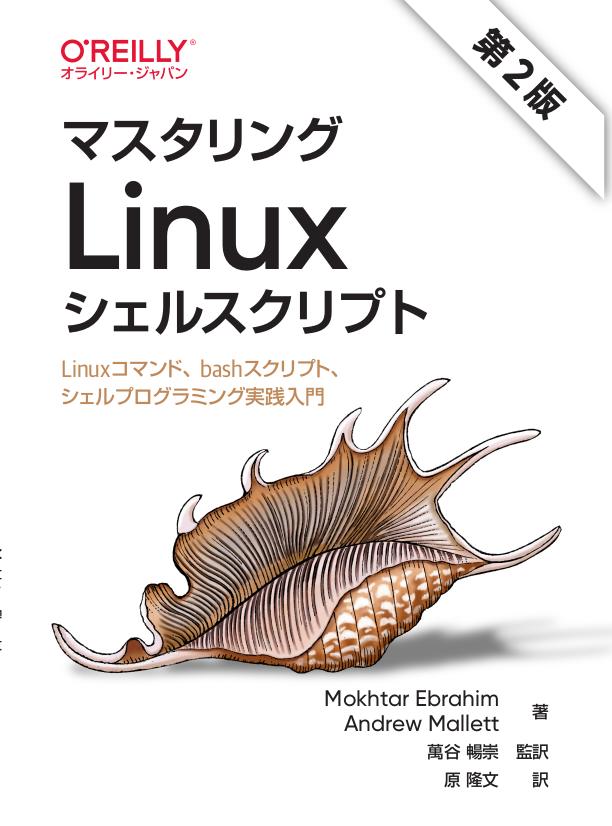

# マスタリングLinuxシェルスクリプト 第2版

---



---

本リポジトリはオライリー・ジャパン発行書籍『[マスタリングLinuxシェルスクリプト 第2版](https://www.oreilly.co.jp/books/9784814400119)』のサポートサイトです。

## サンプルコード

### ファイル構成

|フォルダ名 |説明                         |
|:--        |:--                          |
|appA       |付録Aで使用するソースコード  |
|ch01       |1章で使用するソースコード    |
|ch02       |2章で使用するソースコード    |
|...        |...                          |
|ch14       |14章で使用するソースコード   |

サンプルコードの解説は本書籍をご覧ください。

## ライセンス

[MIT](./LICENSE)

## 正誤表

下記の誤りがありました。お詫びして訂正いたします。

本ページに掲載されていない誤植など間違いを見つけた方は、japan@oreilly.co.jpまでお知らせください。

### 第1刷

#### ■7章 7.2.1 配列の引き渡し P.146
**誤**
```sh
#!/bin/bash
myfunc() {
    arr=$@
    echo "The array from inside the function: ${arr[*]}"
}

test_arr=(1 2 3)
echo "The original array is: ${test_arr[*]}"
myfunc ${test_arr[*]}
```
**正**
```sh
#!/bin/bash
myfunc() {
    arr=("$@")
    echo "The array from inside the function: ${arr[*]}"
}

test_arr=(1 2 3)
echo "The original array is: ${test_arr[*]}"
myfunc "${test_arr[@]}"
```

#### ■7章 7.2.1 配列の引き渡し P.147
**誤**
```
関数の中で配列を取得するために$@が使われていることに注意してください。これを$1にすると、最初の配列要素だけが返されます。
```

```sh
#!/bin/bash
myfunc() {
    arr=$1
    echo "The array from inside the function: ${arr[*]}"
}

my_arr=(5 10 15)
echo "The original array: ${my_arr[*]}"
myfunc ${my_arr[*]}
```

**正**
```
関数内で引数を配列として扱うために("$@")が使われていることと、関数の引数を指定する際に"${test_arr[@]}"のように[@]を使用したうえで二重引用符で囲むことに注意してください。("$@")を("$1")にすると、最初の配列要素だけが返されます。
```

```sh
#!/bin/bash
myfunc() {
    arr=("$1")
    echo "The array from inside the function: ${arr[*]}"
}

my_arr=(5 10 15)
echo "The original array: ${my_arr[*]}"
myfunc "${my_arr[@]}"
```

#### ■7章 7.8 練習問題 7-1 P.155
**誤**
```sh
#!/bin/bash
myfunc() {
    arr=$1
    echo "The array: ${arr[*]}"
}

my_arr=(1 2 3)
myfunc ${my_arr[*]}
```

**正**
```sh
#!/bin/bash
myfunc() {
    arr=("$1")
    echo "The array: ${arr[*]}"
}

my_arr=(1 2 3)
myfunc "${my_arr[@]}"
```

#### ■7章 7.8 練習問題 7-4 P.155
**誤**
```sh
#!/bin/bash
myfunc() {
    arr=$@
    echo "The array from inside the function: ${arr[*]}"
}

test_arr=(1 2 3)
echo "The origianl array is: ${test_arr[*]}"
myfunc (${test_arr[*]})
```

**正**
```sh
#!/bin/bash
myfunc() {
    arr=("$@")
    echo "The array from inside the function: ${arr[*]}"
}

test_arr=(1 2 3)
echo "The origianl array is: ${test_arr[*]}"
myfunc ("${test_arr[@]}")
```

#### ■7章 付録B 練習問題の解答 7-1 P.357
**誤**
```sh
#!/bin/bash
myfunc() {
    arr=$1
    echo "The array: ${arr[*]}"
}

my_arr=(1 2 3)
myfunc ${my_arr[*]}
```

**正**
```sh
#!/bin/bash
myfunc() {
    arr=("$1")
    echo "The array: ${arr[*]}"
}

my_arr=(1 2 3)
myfunc "${my_arr[@]}"
```

#### ■7章 付録B 練習問題の解答 7-4 P.358
**誤**
```sh
#!/bin/bash
myfunc() {
    arr=$@
    echo "The array from inside the function: ${arr[*]}"
}

test_arr=(1 2 3)
echo "The origianl array is: ${test_arr[*]}"
myfunc (${test_arr[*]})
```

**正**
```sh
#!/bin/bash
myfunc() {
    arr=("$@")
    echo "The array from inside the function: ${arr[*]}"
}

test_arr=(1 2 3)
echo "The origianl array is: ${test_arr[*]}"
myfunc ("${test_arr[@]}")
```

**誤**
```sh
#!/bin/bash
myfunc() {
    arr=$@
    echo "The array from inside the function: ${arr[*]}"
}

test_arr=(1 2 3)
echo "The origianl array is: ${test_arr[*]}"
myfunc ${test_arr[*]}
```

**正**
```sh
#!/bin/bash
myfunc() {
    arr=("$@")
    echo "The array from inside the function: ${arr[*]}"
}

test_arr=(1 2 3)
echo "The origianl array is: ${test_arr[*]}"
myfunc "${test_arr[@]}"
```
